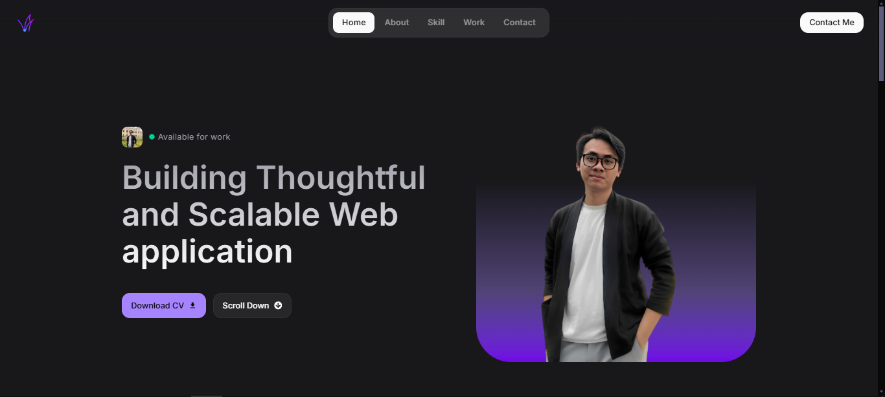
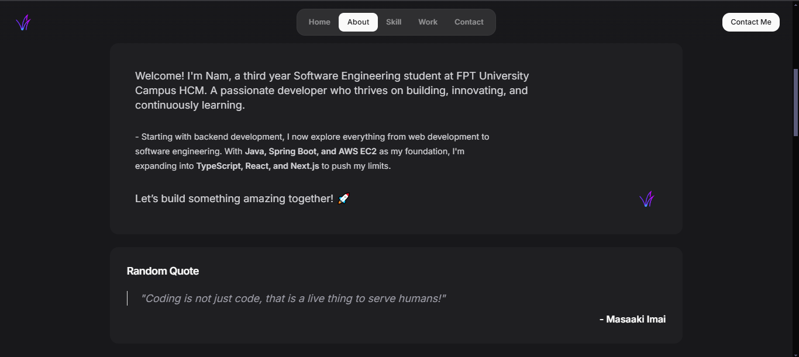
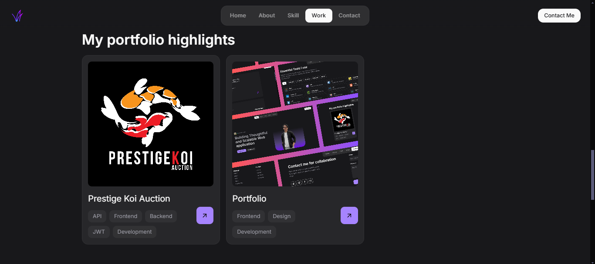
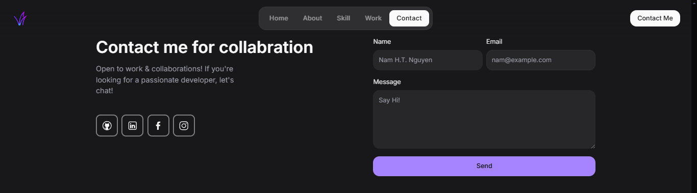
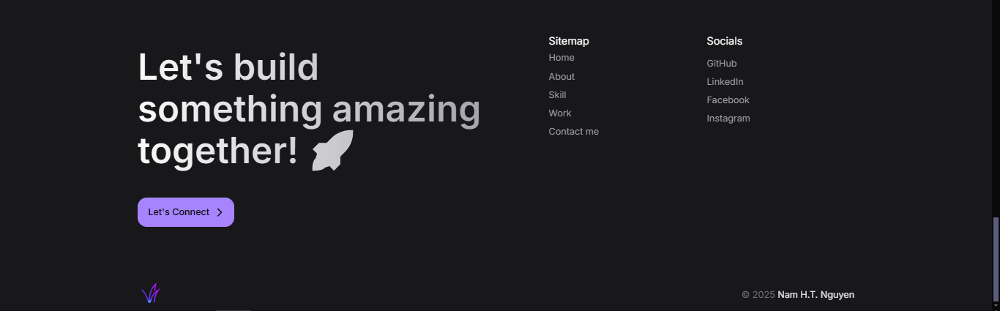

# 🚀 My Portfolio


> A sleek and modern developer portfolio built with **React, TypeScript, and TailwindCSS**,  
> featuring **Lenis smooth scrolling**, **Framer Motion animations**, and **fully responsive design**.

## 📦 Tech Stack

- **Frontend:** React, TypeScript, TailwindCSS, Shadcn-ui, Framer Motion, Lenis

## 🚀 Getting Started

### 1️⃣ Clone the Repository

```bash
git clone https://github.com/lagux-coding/portfolio-react.git
cd portfolio-react
```

### 2️⃣ Install Dependencies

```bash
npm install
```

### 3️⃣ Run Locally

```bash
npm run dev
```

## 📷 Screenshots

| Home                          | About                           | Skills                          |
| ----------------------------- | ------------------------------- | ------------------------------- |
|  |  |  |

| Work                          | Contact                             | Footer                            |
| ----------------------------- | ----------------------------------- | --------------------------------- |
|  |  |  |

## 📜 License

This project is licensed under the [**Apache-2.0 license**](LICENSE).

---

Made with ❤️ by **Me**
