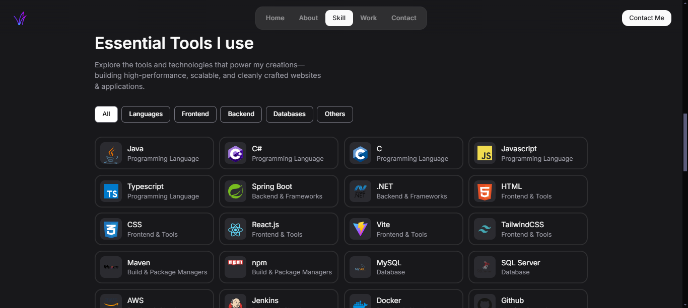
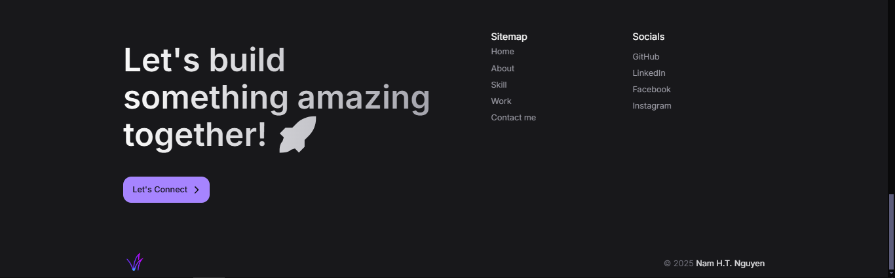

# 🚀 My Portfolio

A sleek and modern developer portfolio built with **React, TypeScript, and TailwindCSS**, featuring styling powered by **Lenis**, **Framer Motion**,...

## 📦 Tech Stack

- **Frontend:** React, TypeScript, TailwindCSS

## 🚀 Getting Started

### 1ï¸âƒ£ Clone the Repository

```bash
git clone https://github.com/lagux-coding/portfolio-react.git
cd portfolio-react
```

### 2ï¸âƒ£ Install Dependencies

```bash
npm install
```

### 3ï¸âƒ£ Run Locally

```bash
npm run dev
```

## 📷 Screenshots

### 🠠Home Section


### 👀 About Section


### 💡 Skill Page



### 💼 Work Page


### 📠Contact Page


### ğŸ Footer Page



## 📜 License

This project is licensed under the [**Apache-2.0 license**](https://github.com/lagux-coding/portfolio-react?tab=Apache-2.0-1-ov-file#readme).

---

Made with â¤ï¸ by **Me**
